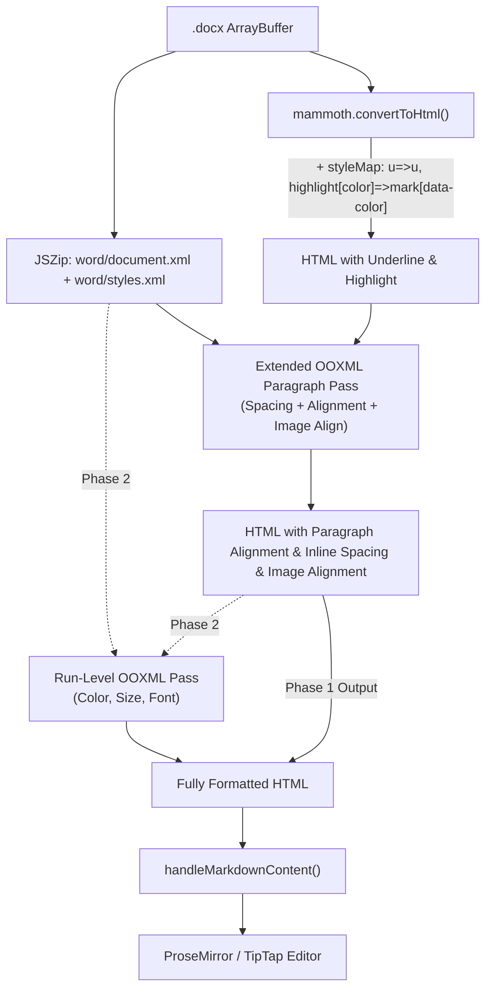

# Design Specification: DOCX Import Parity with Google Docs (TEC-2840)

**Date:** 2026-08-31  
**Status:** Approved  
**Author:** Pair Programming Agent & Bhavesh Rawat  
**Ticket:** [TEC-2840](https://linear.app/fileverse/issue/TEC-2840/docx-and-doc-import-parity-with-gdocs)

---

## 1. Overview & Objectives

When importing `.docx` documents into dDocs, several formatting styles are currently dropped because `mammoth.js` is a semantic converter that discards presentation attributes. However, the dDocs editor already has full TipTap/ProseMirror mark and node support for underline, text color, highlight colors, font family, font size, paragraph alignment, and image alignment.

This specification outlines the architecture and implementation for bringing `.docx` import to parity with Google Docs across all missing formatting dimensions, divided into two distinct phases.

---

## 2. Architecture & Data Flow



The pipeline preserves separation of concerns:
1. **Mammoth Configuration**: Uses `styleMap` to emit semantic `<u>` and `<mark data-color="...">` tags without manual XML parsing.
2. **Extended Paragraph OOXML Pass**: Extends `docx-spacing.ts` to read paragraph alignment (`w:jc`) and image positioning, applying them onto block elements (`text-align`) and `` tags (`data-align`).
3. **Run-Level OOXML Pass (Phase 2)**: Extracts `w:color`, `w:sz`, and `w:rFonts` directly from `document.xml` runs, resolving style inheritance, and performs cursor-based matching to inject `<span style="...">` tags into the HTML.
4. **Downstream Ingestion**: `handleMarkdownContent` sanitizes and parses the HTML into ProseMirror nodes/marks via existing registered extensions.

---

## 3. Scope & Phased Roadmap

### Phase 1: High-Impact & Paragraph-Level Features (Immediate)
1. **Underline**: Emit `<u>` tags from `w:u`.
2. **Highlight Colors**: Emit `<mark data-color="#HEX">` from 16 OOXML named colors.
3. **Paragraph Alignment**: Read `w:jc` (`left`, `center`, `right`, `both`/`justify`) and apply `style="text-align: ..."` to block elements (`p`, `h1`-`h6`, `li`).
4. **Image Alignment**: Set `data-align="start|center|right"` on imported images based on paragraph `w:jc`.

### Phase 2: Run-Level Properties (Follow-up)
1. **Text Color**: Parse `w:color @w:val` hex values from run properties (`w:rPr`).
2. **Font Size**: Parse `w:sz @w:val` half-points, convert to `pt` (dividing by 2).
3. **Font Family**: Parse `w:rFonts @w:ascii`.
4. **Cursor Matching**: Map OOXML run ranges to DOM text nodes within each paragraph and wrap with `<span style="color: ...; font-size: ...; font-family: ...">`.

---

## 4. Phase 1 Detailed Design

### 4.1 Underline & Highlight Style Mapping

In `package/extensions/docx/docx-import.tsx`, pass `styleMap` to `mammoth.convertToHtml()`:

```typescript
const DOCX_STYLE_MAP = [
  // Underline
  'u => u',

  // Predefined OOXML highlight colors mapped to Hex
  "highlight[color='yellow'] => mark[data-color='#FFFF00']",
  "highlight[color='green'] => mark[data-color='#00FF00']",
  "highlight[color='cyan'] => mark[data-color='#00FFFF']",
  "highlight[color='magenta'] => mark[data-color='#FF00FF']",
  "highlight[color='red'] => mark[data-color='#FF0000']",
  "highlight[color='blue'] => mark[data-color='#0000FF']",
  "highlight[color='darkBlue'] => mark[data-color='#00008B']",
  "highlight[color='darkCyan'] => mark[data-color='#008B8B']",
  "highlight[color='darkGreen'] => mark[data-color='#006400']",
  "highlight[color='darkMagenta'] => mark[data-color='#8B008B']",
  "highlight[color='darkRed'] => mark[data-color='#8B0000']",
  "highlight[color='darkYellow'] => mark[data-color='#808000']",
  "highlight[color='darkGray'] => mark[data-color='#A9A9A9']",
  "highlight[color='lightGray'] => mark[data-color='#D3D3D3']",
  "highlight[color='black'] => mark[data-color='#000000']",
  'highlight => mark',
];
```

The TipTap `Highlight` extension (`multicolor: true`) automatically parses `data-color` into mark attributes.

### 4.2 Paragraph Text Alignment (`w:jc`)

Extend `package/extensions/docx/docx-spacing.ts`:

1. **Type Definitions**:
   ```typescript
   export type DocxParagraphSpacing = {
     spaceBefore: number | null;
     spaceAfter: number | null;
     lineHeight: string | null;
     textAlign: string | null; // 'left' | 'center' | 'right' | 'justify' | null
     hasImage: boolean;
     text: string;
   };
   ```

2. **Attribute Normalization**:
   ```typescript
   const normalizeAlignment = (val?: string | null): string | null => {
     if (!val) return null;
     switch (val.toLowerCase()) {
       case 'left':
       case 'start':
         return 'left';
       case 'center':
         return 'center';
       case 'right':
       case 'end':
         return 'right';
       case 'both':
       case 'distribute':
         return 'justify';
       default:
         return null;
     }
   };
   ```

3. **Style Inheritance & Merging**:
   Extend `readSpacingElement` and `mergeSpacing` to capture and cascade `jc`:
   ```typescript
   type RawParagraphProperties = RawSpacing & {
     jc?: string;
   };
   ```
   Style hierarchy traversal (`resolveStyleSpacing`) will cascade `jc` from `docDefaults` -> `basedOn` styles -> direct paragraph `w:pPr`.

4. **DOM Injection**:
   In `applyDocxSpacingToHtml()`:
   ```typescript
   if (textAlign !== null) {
     element.style.textAlign = textAlign;
   }
   ```

### 4.3 Image Alignment

1. During `readDocxSpacing()`, detect if a `w:p` contains an image (`w:drawing`, `w:pict`, or `v:imagedata`).
2. When `applyDocxSpacingToHtml()` traverses blocks:
   - If an element is a `<p>` whose only element child is an `` (or contains ``), inspect the corresponding `DocxParagraphSpacing`.
   - Set the image's `data-align` attribute:
     - `textAlign === 'center'` -> `data-align="center"`
     - `textAlign === 'right'` -> `data-align="right"`
     - Default / `left` -> `data-align="start"`
   - Also preserve standard `dataalign` for backwards compatibility with media paste handlers.

---

## 5. Phase 2 Detailed Design (Run-Level Formatting)

### 5.1 Run Property Extraction & Style Resolution
1. For each `w:p`, iterate child runs `w:r`.
2. Extract direct formatting from `w:rPr`:
   - `w:color`: Hex value (e.g. `FF0000` -> `#FF0000`). If `w:themeColor` is present without explicit `w:val`, omit to prevent inaccurate color shifts.
   - `w:sz`: Half-points converted to points (e.g. `28` -> `14pt`).
   - `w:rFonts`: Latin font family from `@w:ascii`.
3. Resolve character styles (`w:rStyle`) and default run properties (`w:rPrDefault`).

### 5.2 Cursor-Based Text Node Wrapping
1. For each HTML block corresponding to a `w:p`:
   - Collect ordered DOM `Text` nodes via TreeWalker.
   - Maintain character offsets matching the concatenated plain text against the OOXML runs.
2. For each run containing active styles (`color`, `fontSize`, or `fontFamily`):
   - Locate overlapping Text nodes.
   - If a Text node spans past the run boundary, split it using `textNode.splitText()`.
   - Wrap the targeted Text node in `<span style="color: ...; font-size: ...; font-family: ...">`.
3. If text verification fails between HTML block text and OOXML text, skip run wrapping for that specific paragraph and preserve the HTML untouched.

---

## 6. Testing & Quality Assurance

### 6.1 Unit Tests
1. **`docx-import.test.ts` / `docx-spacing.test.ts`**:
   - Test `styleMap` parsing for underline (`<u>`) and all 16 highlight color variants (`<mark data-color="...">`).
   - Test paragraph alignment resolution (`left`, `center`, `right`, `both`) with direct properties and style hierarchy.
   - Test image alignment attribute assignment on image-only paragraphs.
   - Test text mismatch safety: ensures non-matching HTML structures fall back gracefully without corruption.

### 6.2 Regression Safety
- Ensure existing spacing attributes (`marginTop`, `marginBottom`, `lineHeight`) and blank line preservation (`preserveEmptyParagraphs: true`) remain intact.
- Ensure large file uploads and IPFS image conversion continue functioning seamlessly.

---

## 7. Implementation Plan

- **Step 1**: Update `docx-import.tsx` with comprehensive `styleMap` for underline and highlight colors.
- **Step 2**: Enhance `docx-spacing.ts` to parse `w:jc` and image presence from `w:pPr` and `styles.xml`.
- **Step 3**: Update `applyDocxSpacingToHtml` in `docx-spacing.ts` to stamp `textAlign` and image `data-align`.
- **Step 4**: Add comprehensive unit tests in `docx-spacing.test.ts` verifying alignment, highlight, underline, and fallback handling.
- **Step 5**: Run full test suite (`npm test` / `vitest`) to verify no regressions.
